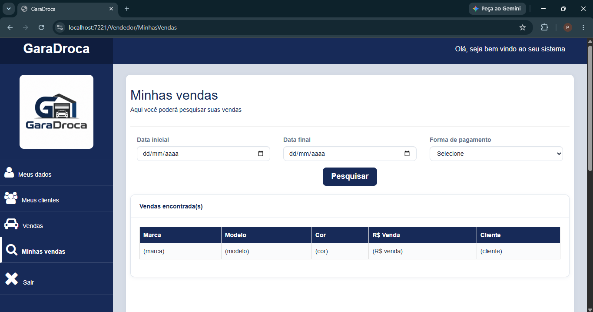
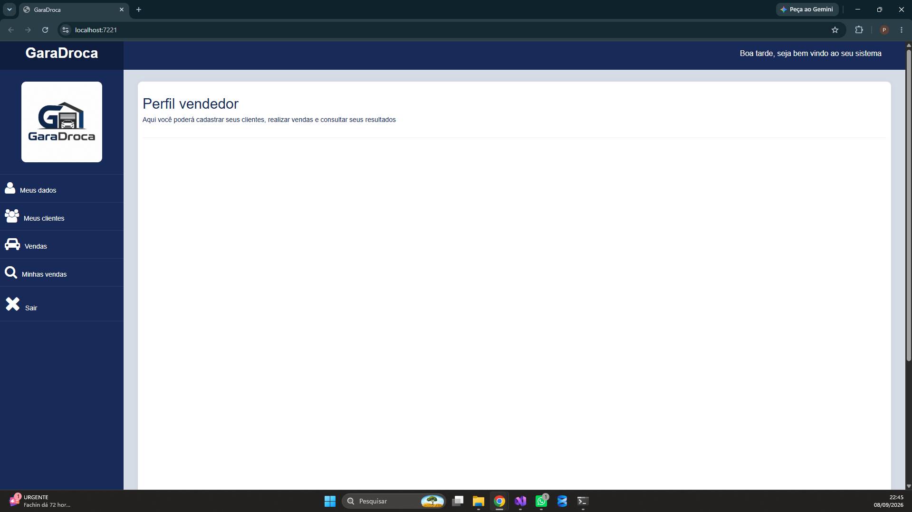
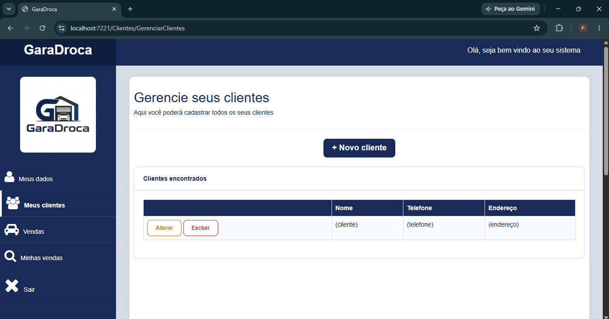

# WebVendedor

Aplicação web (ASP.NET Core MVC) de vendas, parte do ecossistema GaraDroca — versão web do sistema desktop, com integração via API.

## Funcionalidades

- Cadastro e consulta de veículos
- Gestão de vendas
- Área de vendedores

## Tecnologias

- C#
- ASP.NET Core MVC
- API
- Bootstrap

## Telas

